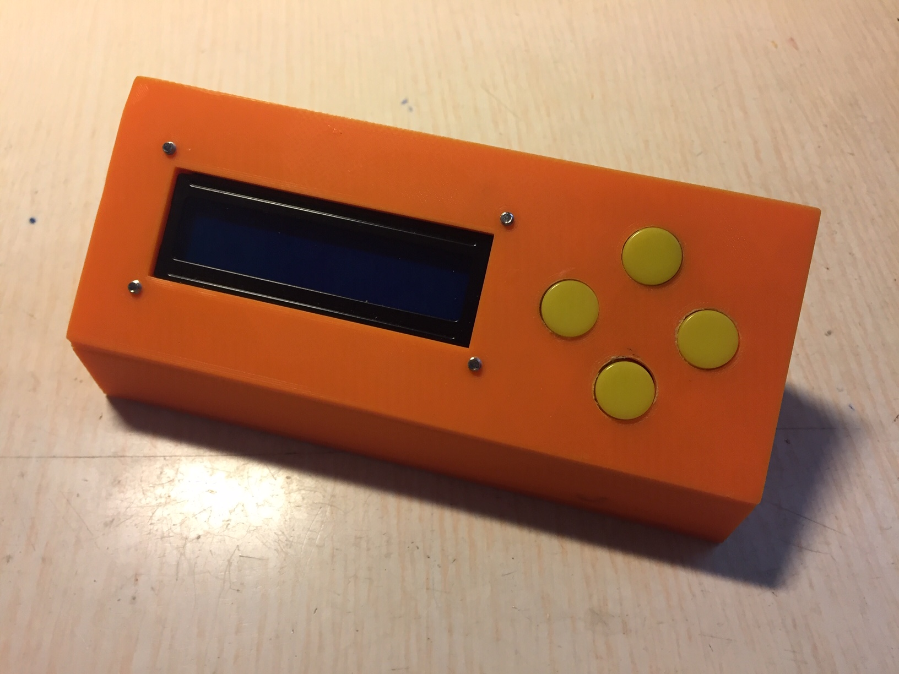
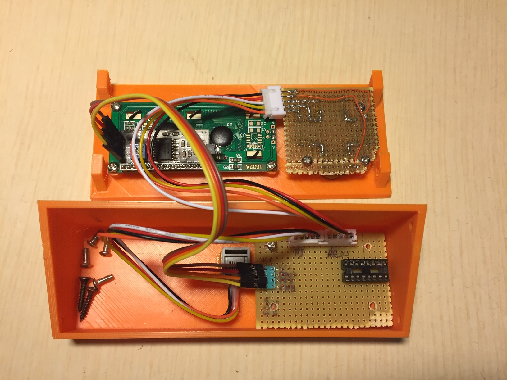
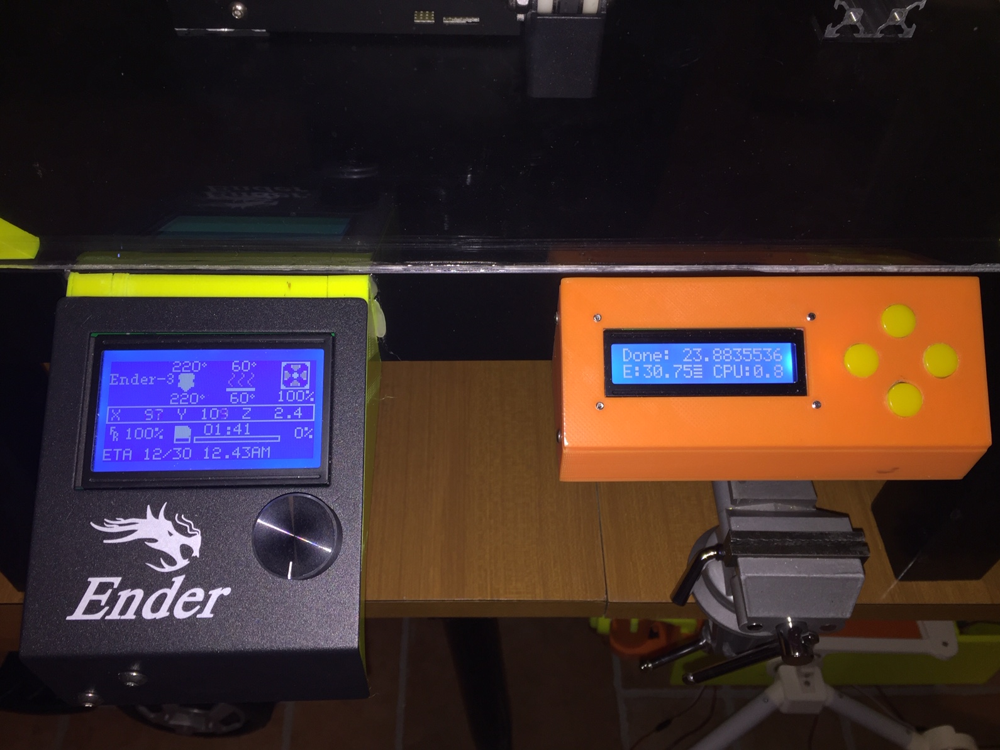

# 3dprinter-controlpanel
A 3D Printer control panel

This is a simple box for a LCD/pushbutton control panel to be added on a 3d printer Ikea Lack enclosure. Pushbuttons and LCD displays used are:

PCB Pushbutton
https://a.aliexpress.com/_BTCl76

2x16 LCD with I2C interface
https://a.aliexpress.com/_BSW2nI

The thingiverse project with all STL files to print is https://www.thingiverse.com/thing:4482919

